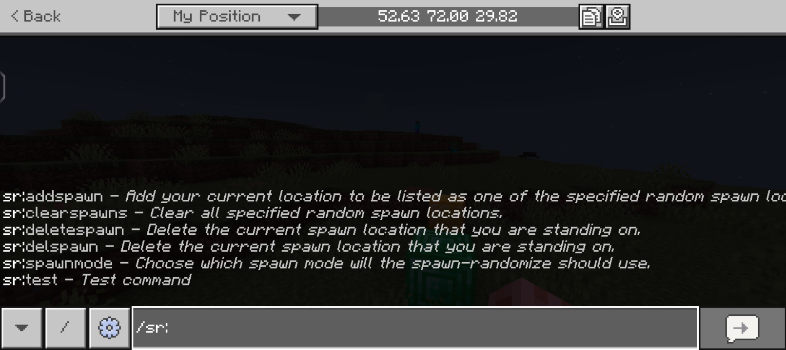

# Spawn-Randomizer

A Minecraft: Bedrock Edition script that randomize the spawn point location of a new players. Therefore, you can easily spreadout all your players once they joined without manually spreading them out.

## Requirements
- Beta APIs enabled in experimental features section.

## Features
- Automatically randomize a new player spawn location depending on the threshold or setting.
- Administrator may specify locations for new players to be teleported on one of the specified locations and that will be their spawn point.
- You may choose which spawn mode will the script use whether it is `default`, `specified`, or `vanilla`.
- Support custom slash commands. See [commands list](docs/COMMANDS.md)

## Contributions
- **Reporting Bugs** - If you encounter any bugs while using LandLocker, please open an [issue](https://github.com/IndeedItzGab/Spawn-Randomizer/issues/new) in our github repository. Ensure to include a detailed description of the issue and steps to reproduce it.
- **Submitting a Pull Request** -We appreciate code contribution for this project. Especially if you have fixed a bug or implemented a new feature, you may submit a pull request.

Please ensure your code follows our coding standard and includes tests where possible.

## Copyright
© 2025 IndeedItzGab. All rights reserved.
- You may not distribute this project without explicit permission and proper credit.
- You may modify this project for **personal use only**.

## Social
- [Discord](https://discord.gg/4TceQdswpW)
- [Twitter/X](https://x.com/IndeedItzGab?t=mVb6cc54QfokUthzfjZrXQ&s=09)
- [Tiktok](https://www.tiktok.com/@indeeditzgab?_t=ZS-8wILO97Irf6&_r=1)
- [Youtube](https://youtube.com/@indeeditzgab?si=aTD1oMnwc6g6NS9L)
- [GitHub](https://github.com/IndeedItzGab)

## Support Me
- [PayPal](https://www.paypal.me/GabrielBondoc09)
