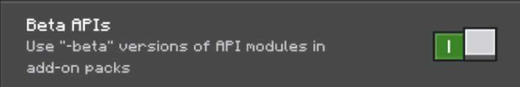

# INSTRUCTIONS
Having a trouble on how to install and use the BedrockTeams? don't worry, this page is perfect for you as it shows detailed explanation and instructions.

## Client/Locally or Realm
- Download the latest pack in [CurseForge](https://www.curseforge.com/minecraft-bedrock/scripts/spawn-randomizer).
- After downloading, start importing it to your Mineraft: Bedrock Edition.
- Once imported, you can either activate it to your realm or your world.
- Make sure that the "BETA APIs" is enabled in the experimental feature section.


## Dedicated Server
### Aternos
- To properly install this project to your aternos server, you must carefully follow the instruction given by aternos itself.
  - [installing add-on](https://support.aternos.org/hc/en-us/articles/360042095232-Installing-addons-Minecraft-Bedrock-Edition) to your server.
  - [Enabling **BETA APIs**](https://support.aternos.org/hc/en-us/articles/4407553257873-Enabling-experimental-gameplay-Minecraft-Bedrock-Edition) experimental feature tl your server.
### Any
Not most of the host services provide the same mechanics as aternos. Therefore, this method is a bit complicated, but you could also use this method for installing add-on into your aternos server.
- **New World Method**
  - Follow the guide from [Client/Locally](#clientlocally-or-realm) instruction.
  - Export the world from your game files.
  - Upload the world to the server's world folder.
  - Upload the project's folder to the `server/files/development_behavior_packs`
  - Edit or Create a new file with the name "world_behavior_packs.json" inside the world with Beta APIs enabled.
    - The content of the `world_behavior_packs.json` should be like this:
    ```
    [
      "pack_id": "39e659c0-785d-4475-a051-b7267dcc9e3b",
      "version": [ 1, 0, 1 ]
    ]
    ```